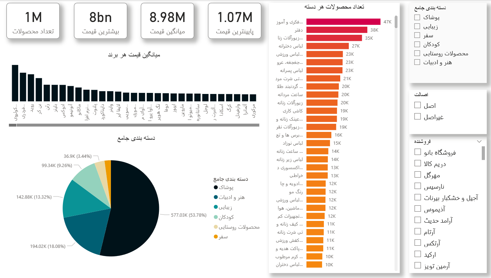

---
<div dir="rtl">

# 📊 داشبورد Power BI: تحلیل محصولات دیجی‌کالا

این پروژه شامل ساخت یک داشبورد تعاملی و تجزیه‌وتحلیل داده‌های محصولات سایت دیجیکالا در محیط Power BI است. این داشبورد به تحلیل ویژگی‌های محصولات، فروشندگان، زیر‌دسته‌بندی‌ها و قیمت‌ها می‌پردازد.

---

## 📁 دیتاست

- 📌 منبع: [Digikala Comments and Products - Kaggle](https://www.kaggle.com/datasets/radeai/digikala-comments-and-products)
- داده شامل اطلاعاتی درباره:
  - محصولات  
  - قیمت  
  - برند  
  - فروشنده  
  - دسته‌بندی‌ها  
  - نظرات کاربران  

---

## 🧠 مراحل انجام پروژه

1. وارد کردن دیتاست Digikala  
2. ساخت جداول کمکی:
   - جداسازی `زیر دسته‌بندی` و `دسته‌بندی اصلی` در جدول‌های جداگانه
   - ساخت جدول مرجع برای ارتباط ستاره‌ای (Star Schema)
3. مدل‌سازی داده (Data Modeling):
   - ایجاد روابط بین جدول‌ها
   - اصلاح نوع Cardinality و انتخاب Active Relationship
4. ایجاد Measureها با DAX
5. طراحی داشبورد تعاملی (Visuals):
   - KPI Cards  
   - Slicers  
   - Column Charts  
   - Treemaps  
   - Pie Charts  
   - Sidebar برای فیلترهای تعاملی  

---

## 🧮 استفاده از DAX

در طول پروژه، از چندین فرمول DAX برای محاسبات استفاده شده است:

### 🔹 تعداد کل محصولات:
```dax
Product Count = COUNTROWS(Products)
```

### 🔹 میانگین قیمت محصولات:
```dax
Average Price = AVERAGE(Products[price])
```

### 🔹 بیشترین قیمت:
```dax
Max Price = MAX(Products[price])
```

### 🔹 تعداد فروشنده‌های فعال:
```dax
Active Sellers = DISTINCTCOUNT(Products[seller])
```

### 🔹 مجموع قیمت محصولات:
```dax
Total Price = SUM(Products[price])
```

### 🔹 تعداد محصول در هر زیر دسته:
```dax
Product Count by Subcategory = COUNTROWS(RELATEDTABLE(Products))
```

📌 بسته به مدل‌سازی، برخی Measureها به صورت Visual-Level Filter هم تعریف شده‌اند.

---

## 🖼️ ویژگی‌های داشبورد نهایی

- طراحی بصری با **نوار کناری (Sidebar)** شامل فیلتر برند، دسته، فروشنده و اصالت  
- تعامل‌پذیری بالا با استفاده از Slicerها  
- ویژوال‌های ساده و قابل فهم برای نمایش شاخص‌های کلیدی  
- چیدمان مدرن و تمیز (Responsive Layout)  

---

## 📎 ابزارهای استفاده‌شده

- Power BI Desktop  
- DAX Editor  
- Selection Pane، Bookmarks، Buttons (اختیاری برای تعامل پیشرفته)

---

## 📌 توسعه‌های آینده

- افزودن تحلیل زمانی (در صورت وجود تاریخ ثبت محصول)
- نمایش وضعیت موجودی، رضایت کاربران و امتیازات
- اتصال به داده‌های زنده از API یا پایگاه داده‌ها

---

## ✨ نتیجه‌گیری

این پروژه نشان می‌دهد چگونه می‌توان با استفاده از ابزارهای Power BI و مدل‌سازی داده، به بینش‌هایی عمیق از داده‌های خام فروشگاه آنلاین دست یافت. طراحی مؤثر داشبورد به تحلیل سریع و تصمیم‌گیری کمک می‌کند.

---

## 📬 تماس

اگر سوال یا پیشنهاد دارید، خوشحال می‌شوم از طریق [GitHub Issues](#) یا پیام مستقیم در تماس باشید.

</div>


---
