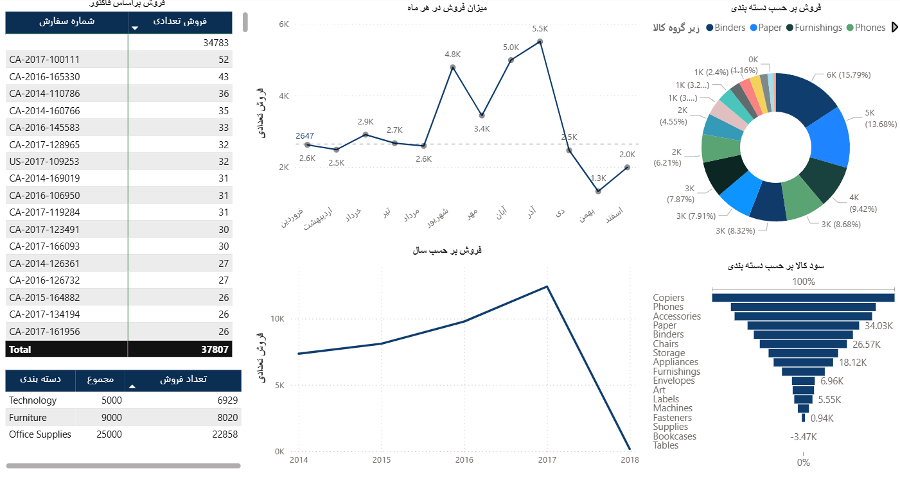

---

# داشبورد فروش

## معرفی

این مخزن شامل یک داشبورد پاور بی‌آی بسیار زیبا و کاربردی است که برای تحلیل مجموعه داده فروش طراحی شده است. این داشبورد با بهره‌گیری از مدل‌سازی داده پیشرفته و DAX (عبارات تحلیل داده) دیدی عمیق نسبت به عملکرد فروش، رفتار مشتریان و روند محصولات ارائه می‌دهد و تجربه‌ای تعاملی و روان فراهم می‌کند.

---

## مدل‌سازی داده

مجموعه داده شامل سه شیت اصلی است: **سفارشات (Orders)**، **مرجوعی‌ها (Returns)** و **هدف‌ها (Target)** که به دقت مدل‌سازی شده‌اند تا پرس‌وجوهای سریع و نمایش‌های معنادار را ممکن سازند:

* **ساختار داده نرمال شده:**

  * ارتباط بین شیت سفارشات و مرجوعی‌ها بر اساس شناسه سفارش (Order ID) برای پیگیری دقیق مرجوعی‌ها.
  * ادغام شیت هدف برای مقایسه فروش واقعی با اهداف تعیین شده در دسته‌بندی‌های مبلمان، لوازم اداری و فناوری.

* **روابط:**

  * پیاده‌سازی مدل ستاره‌ای (Star Schema) با جدول سفارشات به عنوان جدول واقعیت (Fact Table) و ابعاد مرتبط مانند محصول، مشتری و جغرافیا.
  * این ساختار عملکرد را بهینه کرده و امکان فیلترهای پویا در نمودارها را فراهم می‌کند.

* **پاک‌سازی داده‌ها:**

  * رسیدگی به مقادیر گمشده، استانداردسازی فرمت تاریخ‌ها (تبدیل تاریخ‌های اکسل به فرمت قابل خواندن) و حذف داده‌های تکراری برای تضمین کیفیت داده.

* **ستون‌های محاسباتی:**

  * افزودن ستون‌هایی مانند فروش خالص (با در نظر گرفتن تخفیف‌ها) و حاشیه سود برای تحلیل بهتر.

---

## پیاده‌سازی DAX

عبارات DAX نقش کلیدی در ایجاد محاسبات پیچیده و معیارهای پویا داشتند:

* **معیارهای کلیدی (KPI):**
  ساخت معیارهایی مانند فروش کل، سود کل و نرخ بازگشت.

  ```DAX
  Total Sales = SUM('Orders'[Sales]) * (1 - AVERAGE('Orders'[Discount]))
  ```

* **هوش زمانی:**
  استفاده از توابعی مانند `DATEADD` و `TOTALYTD` برای تحلیل روندهای فروش در طول زمان و مقایسه سال به سال.

  ```DAX
  Sales YoY Growth = DIVIDE(
      [Total Sales] - CALCULATE([Total Sales], DATEADD('Orders'[Order Date], -1, YEAR)),
      CALCULATE([Total Sales], DATEADD('Orders'[Order Date], -1, YEAR))
  )
  ```

* **منطق شرطی:**
  پیاده‌سازی فیلترها و تحلیل سناریوهای خاص مانند فروش بر اساس نوع مشتری یا دسته محصول با استفاده از `CALCULATE` و `FILTER`.

* **مقایسه با هدف:**
  ایجاد معیارهایی برای مقایسه فروش واقعی با اهداف موجود در شیت هدف:

  ```DAX
  Sales vs Target = [Total Sales] - LOOKUPVALUE('Target'[Target Sales], 'Target'[Category], 'Orders'[Category])
  ```

---

## ویژگی‌های داشبورد

این داشبورد هم از نظر ظاهر و هم عملکرد بسیار قوی طراحی شده است:

* **ویژوال‌های تعاملی:**
  نمودارهای میله‌ای، خطی و نقشه‌های جغرافیایی برای نمایش فروش، سود و مرجوعی‌ها بر اساس منطقه، نوع مشتری و دسته محصول.

* **برشگرها و فیلترهای پویا:**
  برشگرهای تعاملی برای تاریخ سفارش، دسته‌بندی و نوع مشتری جهت کاوش دقیق‌تر داده‌ها.

* **طراحی مدرن:**
  استفاده از پالت رنگی مدرن، تایپوگرافی یکپارچه و چیدمان ساده و قابل فهم برای افزایش تجربه کاربری.

* **بینش‌های کلیدی:**
  نمایش محصولات پرفروش، مناطق با نرخ بازگشت بالا و سودآوری بر اساس بخش‌های مشتری، همراه با راهنمایی‌های دقیق.

---

## نکته جالب

یکی از یافته‌های جالب این بود که تخفیف‌ها تاثیر چشمگیری بر سودآوری دارند؛ به عنوان مثال، تخفیف‌های سنگین روی محصولات فناوری (مثل تلفن Cisco IP Phone) باعث شده حاشیه سود منفی شود که نیازمند استراتژی قیمت‌گذاری بهتر است.

---

## نحوه استفاده

1. این مخزن را کلون کنید.
2. فایل `.pbix` را در Power BI Desktop باز کنید.
3. مجموعه داده (`sale_total.xlsx`) را بارگذاری کنید یا به منبع داده مشابه متصل شوید.
4. داشبورد را با استفاده از برشگرها، کاوش‌های عمقی و ویژوال‌های تعاملی بررسی کنید.

---

## بهبودهای آینده

* استفاده از قابلیت‌های هوش مصنوعی Power BI برای پیش‌بینی روند فروش.
* افزودن تحلیل‌های زمانی دقیق‌تر مثل ماهانه یا فصلی.
* بهبود دسترسی با افزودن تم‌های کنتراست بالا و پشتیبانی از صفحه‌خوان.

---

**خوشحال می‌شویم که مشارکت کنید یا بازخورد خود را برای بهتر شدن این داشبورد ارائه دهید!**

---

اگر بخواهی، می‌تونم کمک کنم برای اضافه کردن بخش‌ها یا ترجمه بخش‌های دیگه هم. دوست داری؟
