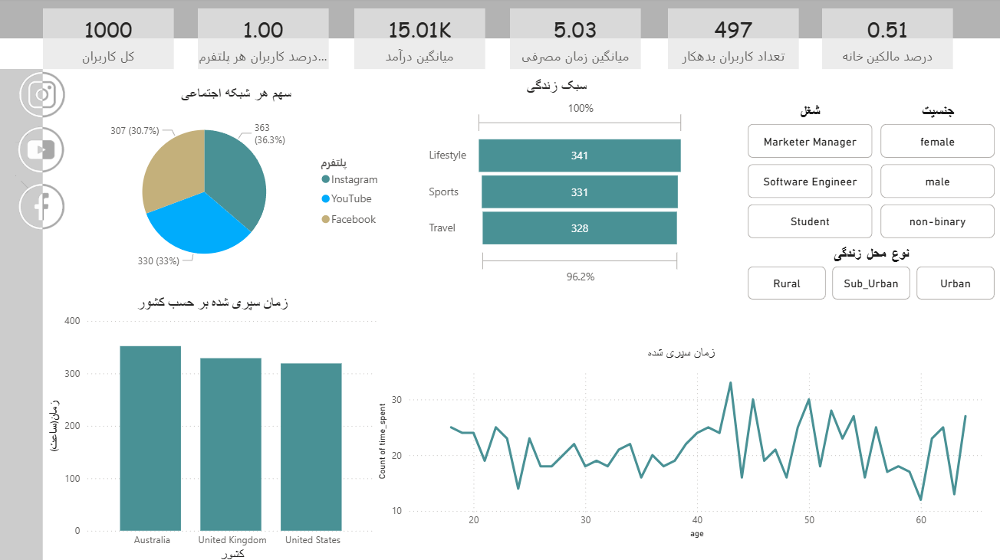

---

# Power BI Dashboard — Social Media Users & Income Analysis

این مخزن شامل مراحل کامل ساخت یک داشبورد **Power BI** بر پایه‌ی دیتاست «میانگین زمان صرف‌شده کاربر در شبکه‌های اجتماعی» است؛ به‌همراه آماده‌سازی داده‌ها (Power Query)، مدل‌سازی، نوشتن Measureها (DAX)، ساخت پارامتر آستانه (What‑If) و طراحی گزارش.

---

## 1) منبع داده (Data Source)
- **Kaggle** — *Average Time Spent By A User On Social Media* (حاوی ستون‌هایی مانند: `age`, `gender`, `time_spent`, `platform`, `interests`, `location`, `demographics`, `profession`, `income`, `indebt`, `isHomeOwner`, `Owns_Car`).  
- لینک دیتاست را اینجا قرار دهید: https://www.kaggle.com/datasets/imyjoshua/average-time-spent-by-a-user-on-social-media

> اگر از فایل `data.csv` همین مخزن استفاده می‌کنید، نیازی به دانلود مجدد نیست.

---

## 2) آماده‌سازی داده‌ها (Power Query)
- Trim/Replace/Format برای تمیزکاری متون
- تبدیل انواع داده‌ها (عدد، متن، بولین)
- ساخت ستون‌های کمکی (مثلاً **Index** در صورت نیاز)
- حذف Nullها و ردیف‌های ناسازگار
- بارگذاری به مدل (Close & Apply)

---

## 3) مدل‌سازی و روابط (Modeling)
- جدول Fact: `Users`  
- جداول ابعادی (اختیاری): `Dim_Platform`, `Dim_Location`, `Dim_Profession` …  
- ایجاد روابط 1:* بین ابعاد و جدول `Users` (کلیدها: نام یا ID استاندارد شده)
- ساخت جدول مخصوص Measureها:  
  ```dax
  _Measures = DATATABLE("Dummy", STRING, { {""} })
  ```
  (سپس ستون `Dummy` را Hide کنید)

---

## 4) پارامتر آستانه (What‑If Parameter)
- Modeling → **New parameter (What‑If)**  
  - Name: `IncomeThreshold`  
  - Data type: Whole Number (مثلاً Min: 0, Max: 100000, Increment: 1000, Default: 15000)  
  - تیک **Add slicer to this page** را فعال کنید.
- Measure آستانه انتخاب‌شده:
  ```dax
  Selected Threshold =
  COALESCE(
      SELECTEDVALUE(IncomeThreshold[IncomeThreshold Value]),
      15000
  )
  ```

---

## 5) Measureهای کلیدی (DAX)
- تعداد کل کاربران:
  ```dax
  Total Users = COUNTROWS('Users')
  ```

- درآمد کل:
  ```dax
  Total Income = SUM('Users'[income])
  ```

- میانگین درآمد:
  ```dax
  Average Income = AVERAGE('Users'[income])
  ```

- کاربران بالای آستانه:
  ```dax
  Users Above Threshold =
  CALCULATE(
      [Total Users],
      FILTER(
          ALLSELECTED('Users'),
          'Users'[income] >= [Selected Threshold]
      )
  )
  ```

- درصد کاربران بالای آستانه:
  ```dax
  Pct Users Above Threshold =
  DIVIDE([Users Above Threshold], [Total Users], 0)
  ```

- درآمد کل بالای آستانه:
  ```dax
  Total Income Above Threshold =
  CALCULATE(
      [Total Income],
      FILTER(
          ALLSELECTED('Users'),
          'Users'[income] >= [Selected Threshold]
      )
  )
  ```

- میانگین درآمد بالای آستانه:
  ```dax
  Average Income Above Threshold =
  DIVIDE([Total Income Above Threshold], [Users Above Threshold], 0)
  ```

---

## 6) طراحی داشبورد (Report)
- **Header KPI Cards**: `Total Users`, `Total Income`, `Average Income`, `Users Above Threshold`, `Pct Users Above Threshold`
- **Slicers**: آستانه درآمد (`IncomeThreshold`)، و فیلترهای دیگر (Platform, Gender, Location)
- **Charts**: Bar/Column (توزیع کاربران)، Donut (سهم پلتفرم)، Line (در صورت وجود تاریخ)
- **KPI Visual**: Indicator = `Average Income Above Threshold`، Target = `Selected Threshold`

> برای جلوگیری از Summarize اشتباه روی ستون‌های شناسه (ID)، نوع داده آنها را **Text** کنید یا در ویژوال از **Don’t Summarize** استفاده کنید.

---

## 7) ساختار پوشه‌ها
```
.
├─ data/
│  └─ data.csv
├─ assets/
│  └─ dashboard-overview.png
├─ dashboard.pbix
└─ README.md
```

---

## 8) اجرای پروژه (How to Run)
1. فایل `dashboard.pbix` را باز کنید.
2. اگر از منبع دیگری استفاده می‌کنید، مسیر فایل CSV را در Power Query تنظیم و **Refresh** کنید.
3. اسلایدر آستانه را جابه‌جا کنید و KPIها/نمودارها را بررسی نمایید.

---
